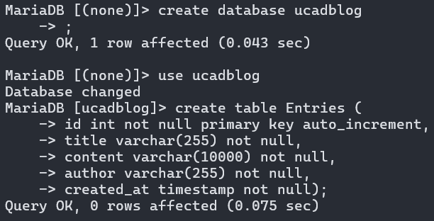

# A simple blog backend

a simple blog backend to replace missed assignments

too lazy to provide the db script or schema so here is a pic of the creation

the instructions mentioned that the data should be validated, but if every user input is a string, what is there to validate?
gave the title and author a max length just in case and some basic sanitization
